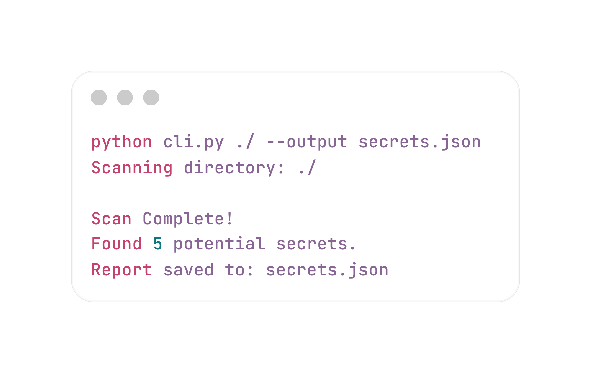

# 🔍 Secret Seeker
**Secret Seeker** is a CLI tool for scanning source code to detect hardcoded secrets such as API keys, passwords and other sensitive data.
It uses regex and entropy detectors to identify suspicious values.

# ✨ Features
- Directory scanning 
- JSON report generation
- Multiple regex patterns for different types of secrets
- Entropy analysis to detect high-entropy strings that may indicate secrets
- Skips binary files and common non-code files
- CLI interface for easy usage

# 🛠️ Architecture
Detector modules: 
- BaseDetector: Abstract class for all detectors
- RegexDetector: Pattern based detection
- EntropyDetector: High-entropy string detection

Each detector implements:
<br />
```python
detect (line: str) -> list
```

# 🚀 Installation 
```bash
git clone https://github.com/alemlodyigor/SecretSeeker
cd SecretSeeker
pip install -r requirements.txt
```

# ▶️ Usage
Default output is `report.json` in the current directory. You can specify a custom output file with the `--output` flag.
```bash
python cli.py <path> --output <filename>.json
```
Example: 
```bash
python cli.py ./ --output secrets.json
```


# 📝 Output
The tool generates a detailed JSON report:
```json
{
  "summary": {
    "total_findings": 10,
    "scan_date": "2026-01-01T12:00:00Z"
  },
  "results": [
    {
      "file": "src/main.py",
      "line_number": 42,
      "detector": "RegexDetector",
      "type": "Generic Secret",
      "value": "password12"
    }
  ]
}
```

# ⁉️ How it works
- Walks through all files in the specified directory
- Skips ignored file types
- Reads each file line by line 
- Each line is analyzed by detectors
- Findings are collected and saved to a JSON report

# 🧪 Testing
```bash
pytest tests/
```